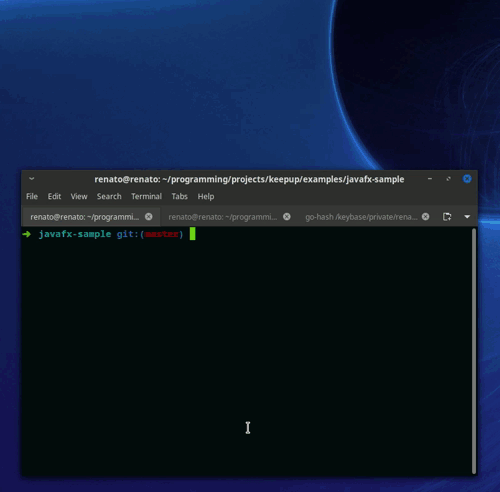

# Keepup

[  ](https://bintray.com/renatoathaydes/maven/keepup/_latestVersion)


Keepup is a library to allow Java 11+ applications to self-update.

It is designed to work specifically with self-contained applications built with [jlink](https://docs.oracle.com/en/java/javase/11/tools/jlink.html).



## Requirements

Keepup has the following requirements for an application to be able to use it:

* must be compiled with Java 11 or newer.
* must be packaged with `jlink`.
* the jlink-created image must be distributed in a zip file.

> See the [trivial-example](examples/trivial-example/build.gradle) for an example of setting up a Gradle-based
> application build to meet the above requirements.

There must also be a mechanism for Keepup to know if there is a newer release. This is usually a HTTP endpoint
which provides the latest version, but can be anything, even a local file.

> Keepup has the optional [keepup-github](keepup-github) module to get releases using the GitHub Releases API v3,
> and the [keepup-bintray](keepup-bintray) module if you prefer to use Bintray. A fully configured Bintray-distributed
> example app is used for testing this module, check it out in the [bintray-tests](keepup-tests/bintray-tests) project.

## Features

Unlike most other self-update libraries, Keepup updates the application as a whole every time, including
the launcher, the JVM, all libraries, everything that is packed with `jlink` and included in the result image!

* works with any app launcher (no custom launcher required).
* updates the app and the JVM itself (as jlink packs the JVM and the app together).
* works with any kind of application: CLI, Server, Desktop App (incl. JavaFX).
* application decides when to check for updates, and when to apply it.
* application can perform any check required in the distributed zip file.
* supports immediate app restart and update on exit.
* does not enforce where app is distributed from: use GitHub Releases, Bintray, Amazon S3, your own server or anything else.  
* 100% configured with code.
* no bash or batch scripts involved: Keepup is pure Java, hence naturally multi-platform.
* works with any JVM language (Kotlin, Groovy, Scala...) that can be packaged with jlink.

## Using Keepup

### Dependency setup

Gradle:

```groovy
implementation "com.athaydes.keepup:keepup-core:1.0"
```

Maven:

```xml
<dependency>
    <groupId>com.athaydes.keepup</groupId>
    <artifactId>keepup-core</artifactId>
    <version>1.0</version>
</dependency>
```

### Module setup

```java
module my.mod {
    requires com.athaydes.keepup.core;
}
```

### Code

An application must create an instance of the `Keepup` class to use Keepup. This requires two things:

#### Implement or configure an `com.athaydes.keepup.api.AppDistributor`

Currently, Keepup provides the following ready-to-use implementations of `AppDistributor`:
 
* [keepup-github](keepup-github): uses the GitHub Releases API v3.
* [keepup-bintray](keepup-bintray): uses Bintray public endpoints (not the API, so authentication is not required).

If you need something else, you can easily implement your own `AppDistributor`:

```java
import com.athaydes.keepup.api.AppDistributor;
import com.athaydes.keepup.api.AppVersion;
import java.io.File;
import java.util.concurrent.CompletableFuture;
import java.util.concurrent.CompletionStage;
import java.util.Optional;

class MyAppDistributor implements AppDistributor<AppVersion> {

    @Override
    public CompletionStage<Optional<AppVersion>> findLatestVersion() throws Exception {
        // Fetch the new version from somewhere...
        // only return non-empty if the version is not the same as the current one!
        // Notice that because we return a Future, we could ask the user in the UI Thread
        // whether or not to download the update before returning the new version.
        return CompletableFuture.completedFuture(Optional.of(AppVersion.ofString("v2")));
    }

    @Override
    public File download(AppVersion version) throws Exception {
        // download the zip file for the new version...
        return new File("my_app.zip");
    }
}
```

#### Implement `com.athaydes.keepup.api.KeepupConfig`

The [KeepupConfig] puts everything together.

Here's a minimal implementation:

```java
import com.athaydes.keepup.api.AppDistributor;
import com.athaydes.keepup.api.KeepupConfig;

class TrivialConfig implements KeepupConfig {

    @Override
    public String appName() {
        return "my-app";
    }

    @Override
    public AppDistributor<?> distributor() {
        return new MyAppDistributor();
    }
}
```

Check the [KeepupConfig](keepup-core/src/main/java/com/athaydes/keepup/api/KeepupConfig.java) interface for all options.

#### Create a `Keepup` instance and set callbacks

Now, create a `Keepup` instance and set callbacks for everything.

> All callbacks have sensible defaults, but you probably should implement them anyway
> to customize how your users will be told about updates, how to validate the download, etc.

```java
class MyApp {

    public static void main(String[] args) {
        var keepup = new Keepup(new MyConfig());

        keepup.onUpdate((newVersion, zipFile) -> {
            // Simple example where we always accept an update.
            // Custom implementations could
            // perform signature verification, verify the checksum,
            // ask the user if they want to update etc.
            // If none of that is required, you don't need to even set this
            // onUpdate callback!
            return CompletableFuture.completedFuture(true);
        }).onNoUpdateRequired(() -> {
            System.out.println("No updates at this time");
        }).onError((e) -> {
            System.err.println("Cannot update due to " + e);
        }).onDone(
            // done but no update: shutdown Keepup's executor if shouldn't check for updates again
            keepup::shutdown,
            // done with update successful: quit and launch the new version!
            UpdateInstaller::quitAndLaunchUpdatedApp);

        // decide when to check for updates...
        keepup.createUpdater().checkForUpdate();
    }
}
```

## Working examples

Please find working example applications using Keepup in the [examples](examples) directory.

You can also look at the [keepup-tests](keepup-tests) sub-projects, which include an [example using
Bintray](keepup-tests/bintray-tests).

## Building Keepup

If you want to build Keepup locally, I recommend that you use [SDKMAN!](https://sdkman.io/) to get 
the right Java distribution (must be Java 11+... must also include the JavaFX runtime if you want to
run the JavaFX examples):

```
sdkman use java 11.0.5.fx-zulu
```

Then, after cloning the repository, run the `check` Gradle task to build and test everything:

```
./gradlew check
```

### Updating/Publishing the test apps

The [Bintray Test App](keepup-tests/bintray-tests) requires a published app on Bintray.
To publish a new version of that app, switch to the `update-test-app` branch and push the changes.
A [GitHub Action](https://github.com/renatoathaydes/keepup/actions) will publish the test app for all 
Operating Systems.
